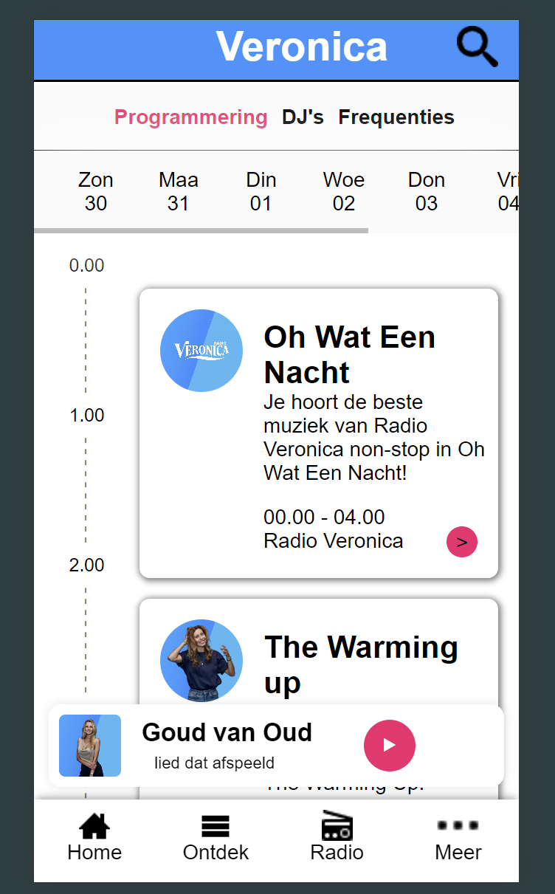
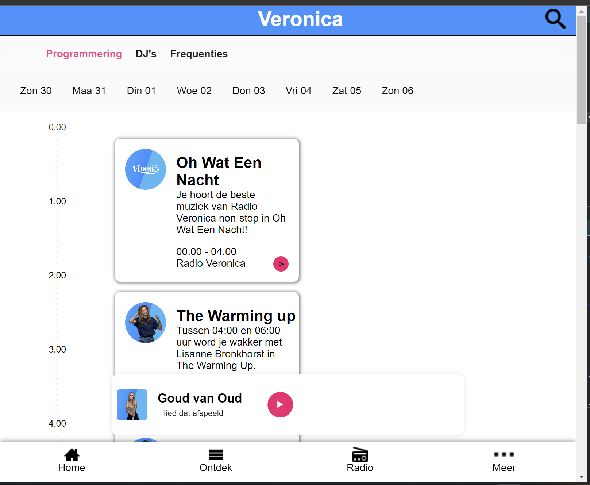
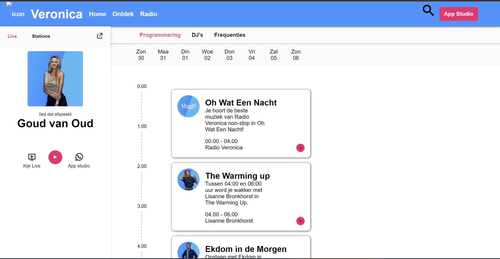
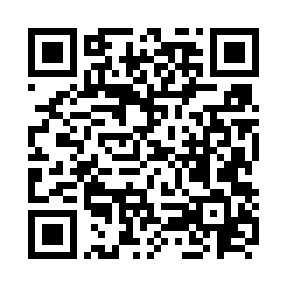

# The Client - Website

Ontwerp en maak een website voor een opdrachtgever en bespreek het resultaat tijdens de Sprint Review.

De instructie van deze leertaak staan in de [INSTRUCTIONS.md](https://github.com/fdnd-task/the-client-website/blob/main/docs/INSTRUCTIONS.md)

## Inhoudsopgave Readme

  * [Beschrijving](#beschrijving)
  * [Kenmerken](#kenmerken)
  * [Bronnen](#bronnen)
  * [Licentie](#licentie)

## Beschrijving
<!-- het doel -->
het doel van dit opdracht is om de bestaande sites van de radiozenders, van Mediahuis, na te bouwen en nieuwe functionaliteiten toe te voegen.
<!-- In de Beschrijving staat hoe je project er uit ziet, hoe het werkt en wat je er mee kan. -->
Deze website lijkt op de website van Veronica, die Triple heeft gemaakt.
op de website kan je makkelijk zien wat de programma van de dag is.
op de website zijn er buttons, deze hebben nog geen linkjes/functies.

<!-- Voeg een mooie poster visual toe 📸 -->
<!-- Voeg een link toe naar Github Pages 🌐-->
Link en QR code naar de website
https://github.com/vsheo/the-client-website

## Kenmerken
<!-- Bij Kenmerken staat welke technieken zijn gebruikt en hoe. Wat is de HTML structuur? Wat zijn de belangrijkste dingen in CSS? Wat is er met Javascript gedaan en hoe? Misschien heb je een framwork of library gebruikt? -->
In de eerste week van de sprint heb ik me geconcentreerd op het maken van een semantische HTML-structuur. Daarna heb ik CSS gebruikt om de lay-out op te bouwen. Tot slot heb ik CSS toegepast om de buttons, afbeeldingen, iconen en tekst te stylen.

Belangrijke CSS-technieken:
Flexbox voor de indeling van de main-sectie.
Grid om de programmacardjes overzichtelijk te plaatsen.
Voor de timeline, die in HTML als een ol is opgebouwd, heb ik in CSS met :after de streepjes toegevoegd en deze vervolgens met rotate(90deg) gedraaid.

Op deze website is nog geen JavaScript toegevoegd.

## Licentie
This project is licensed under the terms of the [MIT license](./LICENSE).